# MDTea-Aggregation-Assessment Benutzerhandbuch

Dieses Dokument ist das Nutzerhandbuch für die Anwendung **MDTea-Aggregation-Assessment**, welche im Rahmen der
Diplomarbeit von Oliver Geisel entstanden ist.


<!-- TOC -->
* [MDTea-Aggregation-Assessment Benutzerhandbuch](#mdtea-aggregation-assessment-benutzerhandbuch)
    * [Über die Software](#über-die-software)
    * [Hardware-Anforderungen](#hardware-anforderungen)
        * [Minimal (wenn GPT4All genutzt)](#minimal-wenn-gpt4all-genutzt)
        * [Empfohlen](#empfohlen)
    * [Installation und Konfiguration](#installation-und-konfiguration)
        * [Programmierumgebungen](#programmierumgebungen)
        * [Neo4J](#neo4j)
        * [GPT4All](#gpt4all)
            * [Remote Nutzung](#remote-nutzung)
            * [Lokale Nutzung](#lokale-nutzung)
    * [Nutzung](#nutzung)
        * [Programmparameter](#programmparameter)
        * [Das erste Mal Starten](#das-erste-mal-starten)
        * [Aggregation (Wissensmodell bearbeiten)](#aggregation-wissensmodell-bearbeiten)
            * [Wissen aus einem Fragment (Text)](#wissen-aus-einem-fragment-text)
                * [1. Fragmenteingabe und Konfiguration](#1-fragmenteingabe-und-konfiguration)
                * [2. Extraktion von Termen](#2-extraktion-von-termen)
                * [3. Extraktion und Bearbeiten von Definitionen](#3-extraktion-und-bearbeiten-von-definitionen)
                * [4. Extraktion und Bearbeiten von Beispielen](#4-extraktion-und-bearbeiten-von-beispielen)
                * [5. Extraktion und Bearbeiten von Code](#5-extraktion-und-bearbeiten-von-code)
                * [6. Extraktion und Bearbeiten von Items (Fragen)](#6-extraktion-und-bearbeiten-von-items-fragen)
                * [7. Integration ins Wissensmodell](#7-integration-ins-wissensmodell)
            * [Einbinden von einzelnen Elementen](#einbinden-von-einzelnen-elementen)
        * [Generation (Generierung von Material/Kursen)](#generation-generierung-von-materialkursen)
            * [Wahl der Vorlage](#wahl-der-vorlage)
            * [Wahl des Kurses](#wahl-des-kurses)
            * [Generierung](#generierung)
        * [Finalization (Bearbeiten und Export von Kursen)](#finalization-bearbeiten-und-export-von-kursen)
            * [Bearbeiten](#bearbeiten)
                * [Metadaten bearbeiten](#metadaten-bearbeiten)
                * [Reihenfolge ändern](#reihenfolge-ändern)
                * [Assign und Unassign](#assign-und-unassign)
                * [Export eines Kurses](#export-eines-kurses)
            * [Test-Export](#test-export)
            * [Export-Übersicht](#export-übersicht)
    * [Technische Details](#technische-details)
<!-- TOC -->

## Über die Software

Die Software stellt einen Prototyp für eine mögliche Realisierung von MDTea dar.
MDTea ist ein System, welches die Generierung von Materialien und Kursen für die Lehre unterstützen soll.
Die zentrale Komponente ist dabei das Wissensmodell, welches das gesamte Wissen des Systems hält.
In MDTea kann das Wissensmodell mit Wissen angereichert werden. Dies ist die Aggregation-Phase.
In der Generation-Phase wird das Wissen genutzt, um Materialien mithilfe eines Kursplanes zu generieren.
In der Finalization werden die generierten Materialien zu einem Kurs, welcher durch den Kursplan definiert wird,
zusammengestellt.
Ein Nutzer kann den Kurs dann bearbeiten und exportieren.
Weitere Details zu den Phasen finden sich in der entsprechenden
Arbeit [MDTea großer Beleg](https://nbn-resolving.org/urn:nbn:de:bsz:14-qucosa2-894079)

Die Software ist in Java geschrieben und nutzt das Spring-Framework.
Das Frontend wird mit Thymeleaf umgesetzt.
Die Anwendung kann drei Phasen von MDTea umsetzen.
Das sind die _Aggregation_, die _Generation_ und die _Finalization_.
Die Anwendung ist in der Lage, das Wissensmodell zu bearbeiten, Materialien zu generieren und Kurse zu bearbeiten
und zu exportieren.


<hr>

## Hardware-Anforderungen

Das System kann je nach Nutzung sehr hohe Anforderungen haben. Es sollte ein sehr gutes System genutzt werden.

### Minimal (wenn GPT4All genutzt)

* 4G RAM
* 5 GB Speicher (Modell abhängig)
* Betriebssystem egal (MacOS mit ARM-Chips wird abgeraten)

### Empfohlen

* 16GB oder mehr (je nach Modell für GPT4All)
* 4 oder mehr Kerne (Je mehr, umso besser für GPT4All)
* Grafikkarte mit Cuda Support - RAM ist wichtiger als die Leistung. Wenn das Modell zu groß ist, wird die Grafikkarte
  nicht genutzt.
* Docker

## Installation und Konfiguration

### Programmierumgebungen

Es werden sowohl Java als auch Python benötigt. Die Installation von Java und Python wird hier nicht erklärt.
Die konkrete Version von Java ist wichtig. Es muss exakt die Version 21 sein.
Der Grund sind die benutzten Preview-Features.
Für Python wird mindestens die Version 3.10 benötigt.

Das Projekt ist ein Maven-Projekt, deshalb ist die Anwendung mit ```mvn package``` compiliert und als jar
einsatzbereit. Die Datei ist im erstellten target ordner als ```MDTea-Assessment-Aggregation.jar``` zu finden.

Jedoch sind für den vollständigen Gebrauch 2 externe Komponenten notwendig.
Zum einen ist das eine **Neo4j**-Datenbank, zum anderen eine Instanz von [**GPT4All**](https://gpt4all.io).

### Neo4J

Für Neo4j kann das ```docker-compose.yaml``` im root-Verzeichnis genutzt werden.
Dazu einfach

```bash
docker compose
``` 

im root-Verzeichnis ausführen.

Alternativ kann auch eine eigene Neo4J-Datenbank genutzt werden.
Jedoch muss hier dann entsprechend die Datenbank-Verbindung in `src/main/resources/application.properties` eingestellt
werden.

### GPT4All

Es gibt 2 Möglichkeiten, wie die Anwendung mit GPT4All arbeiten kann.
Entweder *Remote* oder *Lokal*.
Für beide Varianten sind einige Python-Packages notwendig. Diese sind
```bash
argparse
openai 0.28.1
pathlib
requests
gpt4all
```

<span style="color: darkred">Achtung!</span> Diese Komponente ist sehr rechenintensiv.
Sollte das System, auf die Komponente läuft, nicht moderne und gute Hardware besitzen (
siehe [Anforderungen](#hardware-anforderungen)) kann es
zu Verbindungsabbrüchen (nach 10 Minuten) oder gar zum Absturz der Komponente kommen!

#### Remote Nutzung

Für die Remote-Nutzung ist es am einfachsten den Client von der offiziellen Webseite von [GPT4All](https://gpt4all.io)
herunterzuladen und zu installieren.
Für die Installation einfach den Anweisungen auf der Webseite folgen. <br>
Nach erfolgreicher Installation muss mindestens ein Modell für den Client heruntergeladen werden.
Die Anwendung kennt 5 Modelle:

+ "mistral-7b-openorca.Q4_0.gguf"
+ "mistral-7b-instruct-v0.1.Q4_0.gguf"
+ "gpt4all-falcon-newbpe-q4_0.gguf"
+ "nous-hermes-llama2-13b.Q4_0.gguf"
+ "em_german_mistral_v01.Q4_0.gguf"

**Mistral-7b-instruct-v0.1** ist die Empfehlung für die Nutzung mit der Anwendung, da mit diesem Modell auch alle
Prompts getestet wurden.

Weitere Modelle müssen diese in `gpt-connection/model.json` hinzugefügt werden.
Sollte ein Modell nicht verfügbar sein, wird das Default-Modell des Clients genommen.

Der Sever muss allerdings noch in dem GPT4All-Client aktiviert werden.
Dazu geht man in die Einstellungen. 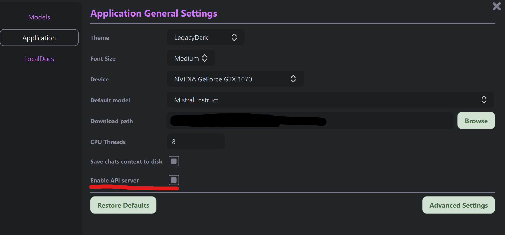

#### Lokale Nutzung

Bei der Nutzung im Lokal muss vorher das Backend installiert sein.
Siehe dazu die [Installationsanleitung](https://github.com/nomic-ai/gpt4all/tree/main/gpt4all-bindings/python).
Wenn das erledigt ist, ist die Nutzung sehr einfach.
Hier kann einfach das gewünschte Modell während die Anwendung gewählt werden.
Im Hintergrund wird das Modell dann heruntergeladen und in `model-files` hinterlegt.
Die Modelle können aber auch vorher heruntergeladen werden und in den Ordner hinterlegt werden.

<hr>

## Nutzung

Die Anwendung kann 3 Teile von MDTea bedienen. Das sind **Aggregation**, **Generation** und **Finalization**.

### Programmparameter

Es gibt 3 Flags, die beim Start der Anwendung angegeben werden können.
<span style="color: darkred">
Jedes Flag sollte mit bedacht gewählt werden und nur in Ausnahmen zum Einsatz kommen!
</span>

* `--init` - Baut die Neo4J-Datenbank mit minimaler Struktur auf
* `--load` - Läd das Wissensmodell aus `src/main/resources/data/knowledge/knowledgedata.json` in die Datenbank
* `--clean` - **löscht** die gesamte Neo4J-Datenbank!

### Das erste Mal Starten

Nachdem die Anwendung mit

```bash
java -jar MDTea-Assessment-Aggregation-1.1.0-SNAPSHOT.jar
```

gestartet wurde, kann über [http://localhost:8080](http://localhost:8080) die Seite geöffnet werden.
Die Startseite sollte dabei etwa wie folgt aussehen 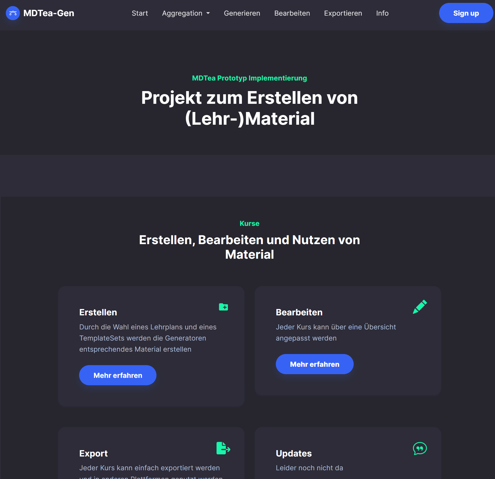

In der Navigation sind folgende Punkte aufgelistet:

* Aggregation
* Erstellen
* Bearbeiten
* Exportieren

### Aggregation (Wissensmodell bearbeiten)

Die Aggregation hat als zentrale Komponente das Wissensmodell.
Die Anwendung bietet folgende Möglichkeiten:

+ Ein Fragment analysieren und Wissen extrahieren. Hierfür ist GPT4All notwendig.
+ Das Modell bearbeiten
+ Neue (einzelne) Elemente hinzufügen
+ Informationen/ Statistik über das Modell

#### Wissen aus einem Fragment (Text)

Der Prototyp unterstützt zurzeit nur die Verarbeitung von Texten.
Die Verarbeitung des Fragmentes geschieht in mehreren einzelnen Schritten.
Um ein Fragment zu verarbeiten, muss der Nutzer auf den Button "Fragment hinzufügen" in der Navigation klicken.


Danach müssen die folgenden Schritte durchgeführt werden:

1. Fragmenteingabe und Konfiguration
2. Extraktion und Bearbeiten von Termen
3. Extraktion und Bearbeiten von Definitionen
4. Extraktion und Bearbeiten von Beispielen
5. Extraktion und Bearbeiten von Code
6. Extraktion und Bearbeiten von Items (Fragen)
7. Integration ins Wissensmodell

##### 1. Fragmenteingabe und Konfiguration

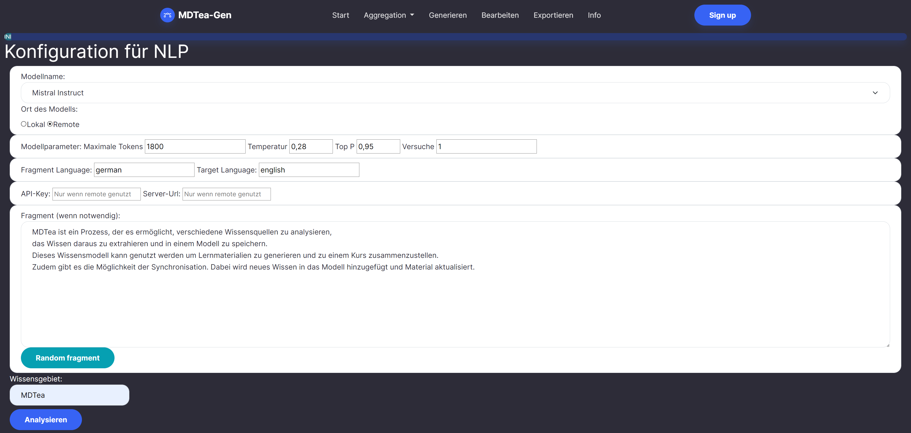
In der Abbildung ist der initiale Schritt für die Gewinnung von Wissen zu sehen.
Hier muss der Nutzer das gewünschte Modell auswählen und die Parameter für das Modell einstellen.
Die wichtigsten Parameter sind die Anzahl der Tokens und der Ort des Modells.
Die Anzahl der Tokens bestimmt, wie viele Tokens das Modell maximal generieren soll.
Der Ort des Modells gibt an, ob GPT4All lokal oder remote genutzt wird.
Die weiteren Parameter sind nicht so wichtig und können so gelassen werden.
Falls ein Modell auf einem anderen Server genutzt werden soll, muss der Server-Ort und der API-Key angegeben werden.

##### 2. Extraktion von Termen

Die Extraktion von Termen geschieht durch das Klicken auf den Button "Extrahieren".
Wenn der Client von GPT4All lokal ausgeführt wird, dann kann beobachtet werden, wie der Prompt in den Client
eingetragen wird und Wort für Wort die Antwort generiert wird.
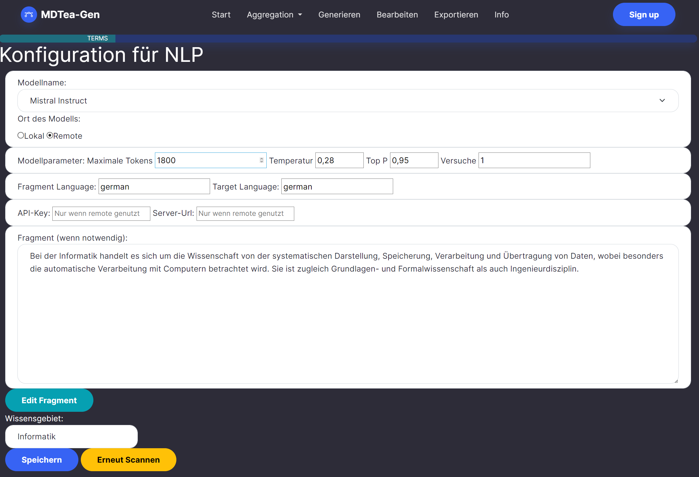
Nach der Extraktion werden die Terme als Vorschlag in der GUI der Anwendung angezeigt. Hier kann der Nutzer nun die
Terme bearbeiten und entscheiden welche Terme behalten werden sollen und welche nicht angenommen
werden. 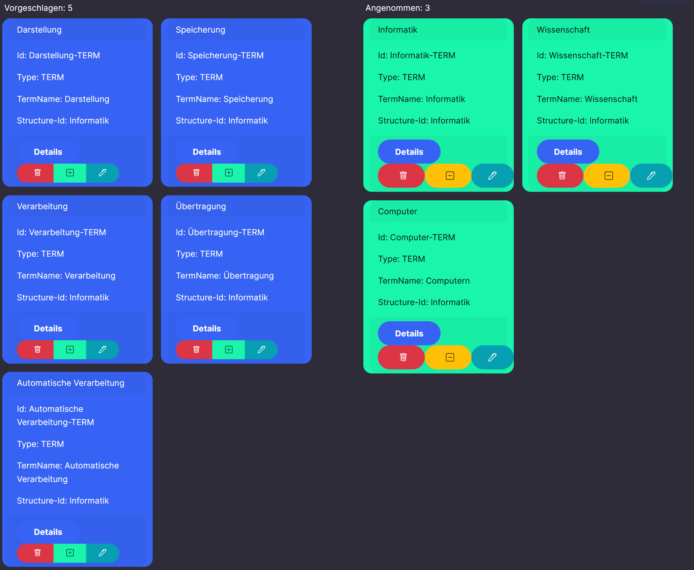
In der Abbildung ist zu sehen wie auf der linken Seite die vorgeschlagenen und auf der rechten Seite die akzeptierten
Terme zu sehen sind.

Wenn alle Terme bearbeitet wurden, kann der Nutzer auf den Button "Weiter" klicken.

##### 3. Extraktion und Bearbeiten von Definitionen

Die Extraktion von Definitionen ist ähnlich wie die Extraktion von Termen.
Nur sind in diesem Fall die akzeptierten Terme entscheidend, welche Definitionen extrahiert werden.

<span style="color: darkred">Achtung!</span>
Die Definitionen können auch "außerhalb" des Fragmentes extrahiert werden.
Je nach Modell kann es sein, das der vordefinierte Prompt nicht perfekt verarbeitet wird und die Definition für
einen Term aus dem "Wissen des GPT-Modells" geholt wird.

Auch hier wird der Button "Extrahieren" geklickt und die Definitionen werden extrahiert.
Genau wie bei den Termen werden die Definitionen als Vorschlag angezeigt und können bearbeitet werden.
Zusätzlich kann jeder Definition auch eine Vielzahl von Termen zugeordnet werden.
Im Normalfall ist bereits der Term, welcher durch die Definition erklärt wird, zugeordnet.

Wenn alles bearbeitet wurde, kann der Nutzer auf den Button "Weiter" klicken.

##### 4. Extraktion und Bearbeiten von Beispielen

##### 5. Extraktion und Bearbeiten von Code

Dieser Schritt wird automatisch übersprungen, weil es zwar geplant war Code zu extrahieren, jedoch nicht umgesetzt
wurde.

##### 6. Extraktion und Bearbeiten von Items (Fragen)

Die letzte Art von Wissen, die extrahiert werden kann, sind Items.
Allgemein sind Items Fragen, Aufgaben oder ähnliches.
Diese Software unterstützt lediglich 4 Arten von Items:

1. **True/False** - Eine Frage, die mit "Wahr" oder "Falsch" beantwortet werden kann.
2. **Single Choice** - Eine Frage, die mit einer Antwort aus einer Auswahl beantwortet werden kann.
3. **Multiple Choice** - Eine Frage, die mit mehreren Antworten aus einer Auswahl beantwortet werden kann.
4. **Fill Out Blanks** - Eine Frage, bei der Lücken in einem Text ausgefüllt werden müssen.

Die Extraktion läuft genauso ab wie bei den anderen Wissensarten.
Der Nutzer kann die Fragen bearbeiten und entscheiden, welche Fragen behalten werden sollen und welche nicht
angenommen.
Zudem kann der Nutzer selbst eigene Fragen hinzufügen.
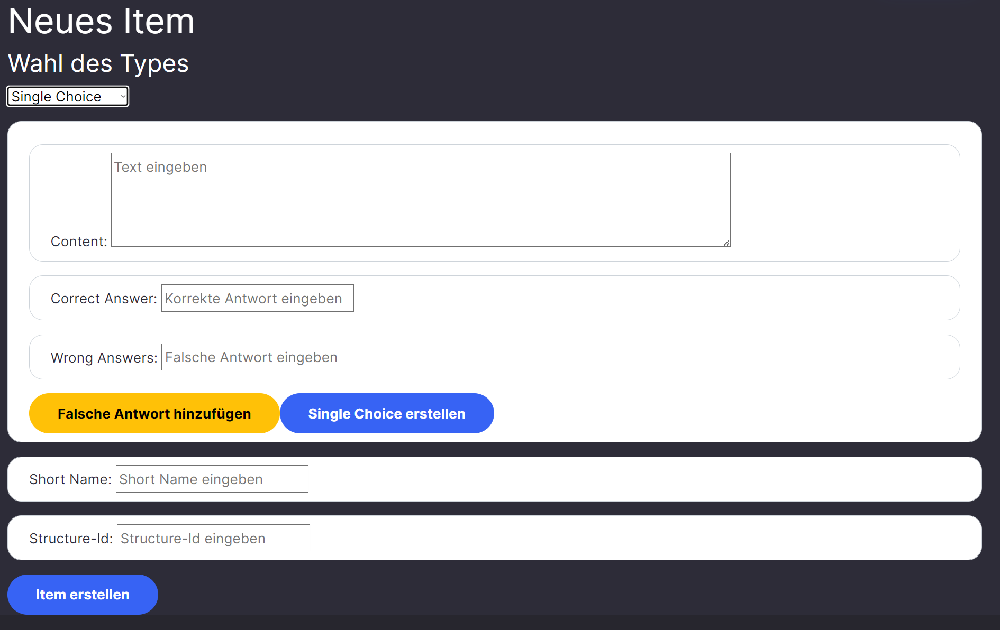

##### 7. Integration ins Wissensmodell

Das ist der letzte Schritt, der das Wissen in das Wissensmodell integriert.
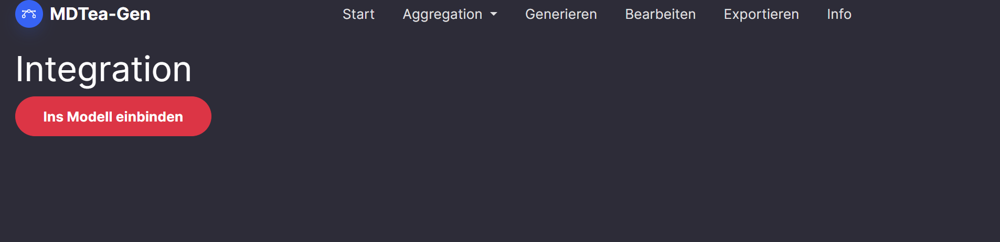
Durch das Klicken auf den Button wird das Wissen in das Wissensmodell integriert.
Nun kann das Wissen in der Generation-Phase genutzt werden.

#### Einbinden von einzelnen Elementen

Wenn nur ein einzelnes Element hinzugefügt werden soll, kann das einfach über eine Maske gemacht werden.
Hierzu geht man in der Navigation auf den Unterpunkt "einzelnes Element hinzufügen" im Bereich
Aggregation. 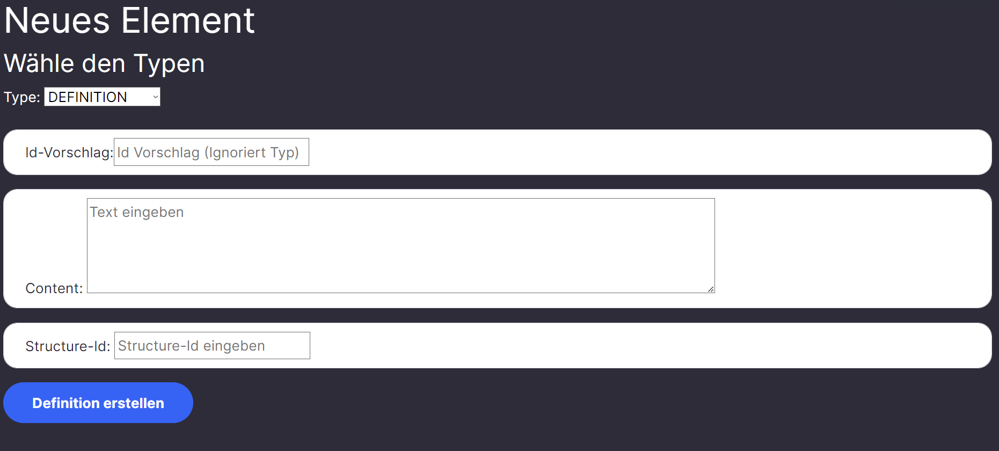
Auf der auftauchenden Seite ist zunächst nur ein Dropdown-Menü zu sehen.
Durch anklicken des gewünschten Types wird automatisch darunter ein Formular angezeigt, in dem die entsprechenden
Daten eingetragen werden können.
Jedes Element hat dabei eine eigene Maske, die spezifisch für das Element ist.
Folgende Tabelle zeigt die Elemente und die entsprechenden Felder (Ohne Items):

| **Term**    | **Definition** | **Code** | **Text** | **Bild** |
|-------------|----------------|----------|----------|----------|
| Struktur-Id |                |          |          |          |
| Term-Name   | Definition     |          |          |          |
|             |                |          |          |          |
|             |                |          |          |          |
|             |                |          |          |          |

Es gibt einen Typ bei Wissenselementen, der Aufgaben, Fragen und ähnliches zusammenfasst.
Dieser Typ ist "Item".
Durch die Auswahl des Typs "Item" wird ein weiteres Dropdown-Menü angezeigt, in dem der Typ des Items ausgewählt werden
kann.
Die Auswahl des Typs bestimmt, welche Felder angezeigt werden.
Folgende Felder können bei Items angezeigt werden:

| **True/False**    | **Single Choice**   | **Multiple Choice**  | **Fill Out Blanks** |
|-------------------|---------------------|----------------------|---------------------|
| Frage             | Frage               | Frage                | Text                |
| Ist Wahr          | Korrekte Antwort    | Korrekte Antworten * | Blanks *            |
|                   | Falsche Antworten * | Falsche Antworten *  |                     |
| Structure-Id      | Structure-Id        | Structure-Id         | Structure-Id        |
| Bezeichnung(Name) | Bezeichnung(Name)   | Bezeichnung(Name)    | Bezeichnung(Name)   |

Die Felder mit einem * sind mehrfach vorhanden und durch einen Klick auf einen Button können weitere Felder
hinzugefügt werden.

### Generation (Generierung von Material/Kursen)

Die Generation ist die zweite Phase von MDTea.
Hier wird das Wissen aus dem Wissensmodell genutzt, um Materialien zu generieren.
In dem Prototypen werden mit dem Wissen aus dem Wissensmodell, einem Kursplan und einer Vorlage Kurse generiert.

#### Wahl der Vorlage

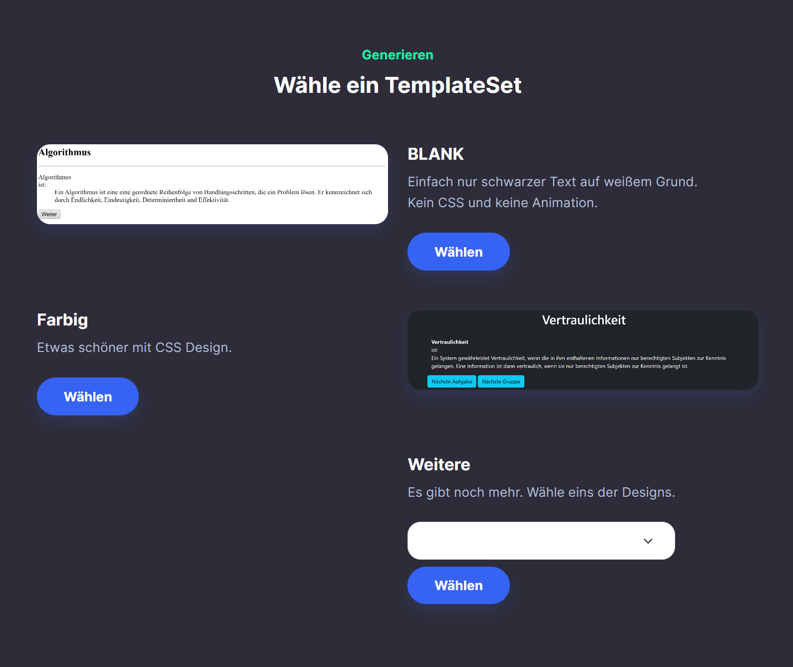
In der Abbildung ist zu sehen, wie eine Vorlage ausgewählt wird.
Die Vorlage ist ein definiert, wie Materialien aussehen sollen.
Zurzeit sind nur die 2 Vorlagen *blank* und *color* verfügbar.

#### Wahl des Kurses

Nach der Wahl der Vorlage muss ein Kursplan ausgewählt werden.
Hier kann entweder ein bereits existierender Kurplan ausgewählt werden oder ein neuer Kursplan hochgeladen in Form
einer JSON-Datei hochgeladen werden.
Danach wird der Inhalt des Kursplanes angezeigt. 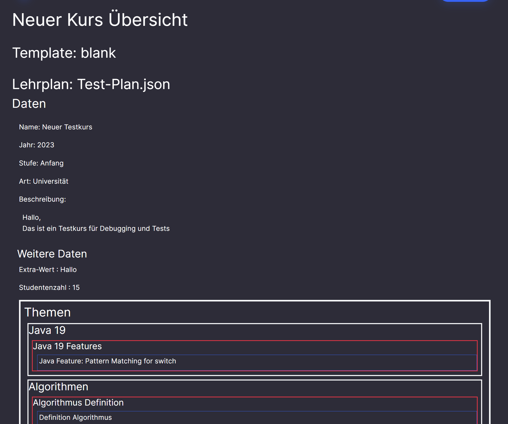
Mit einem Klick auf den Button "Generieren" wird der Kurs generiert.

#### Generierung

Nachdem der Kurs generiert wurde, wird der Nutzer auf eine neue Seite weitergeleitet.
Hier wird der initiale Kurs angezeigt. 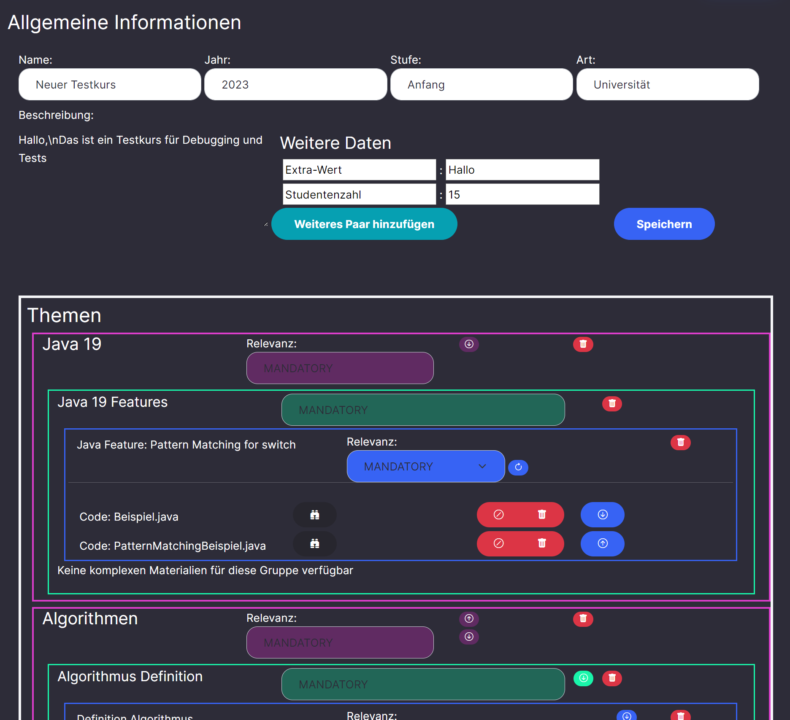
Ab hier beginnt die Finalization-Phase. Für weitere Informationen siehe
[Finalization - Bearbeiten](#bearbeiten).

### Finalization (Bearbeiten und Export von Kursen)

Die Finalization ist die dritte Phase von MDTea. Hier wird der Kurs bearbeitet und exportiert.
Es kann entweder über die Navigation oder über die Generierung auf die entsprechende Funktion zugegriffen werden.

#### Bearbeiten

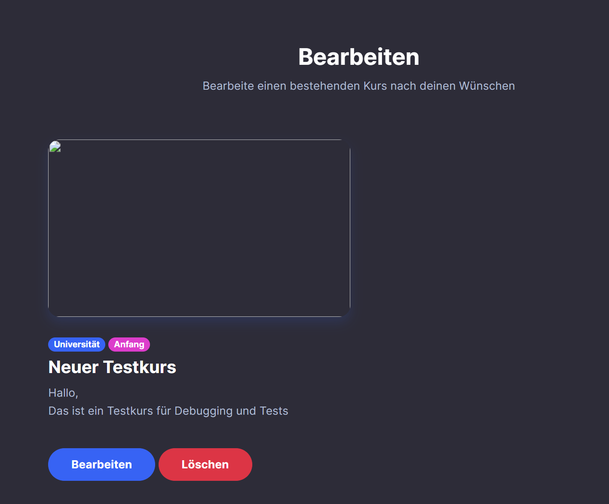
In der Abbildung ist zu sehen, welche Kurse vom System generiert wurden.
Durch den Klick auf den Button "Bearbeiten" wird der Kurs geöffnet und kann bearbeitet werden.

Die Übersicht ist die gleiche, die auch beim erstmaligen Generieren angezeigt wird.
Auf der Seite gibt es 3 Sektionen:

* Kursinformationen
* Kursstruktur
* Nicht zugeordnete Materialien

Die erste Sektion zeigt die Informationen zum Kurs an. Hier werden alle Metadaten des Kurses aufgelistet.
werden.

Die zweite Sektion ist die konkrete Struktur bzw. Abfolge des Kurses.
Die Struktur eines Kurses ist allgemein wie folgt aufgebaut:

* Kurs
    * Kapitel 1
        * Gruppe 1
            * Task 1
                * Material 1-1
                * Material 1-2
            * Task 2
                * Material 2-1
            * Komplexes Material (Test)
        * Gruppe 2
            * Task 1
                * Material 1-1
    * Kapitel 2
    * ...

Jeder Kurs besteht aus Kapiteln, welche wiederum aus mindestens einer Gruppe bestehen.
In den Gruppen sind dann Tasks (Aufgaben).
Jede Aufgabe kann Materialien enthalten.
Zusätzlich kann jede Gruppe komplexe Materialien enthalten, welche wiederum aus Materialien bestehen.
In der aktuellen Version gibt es nur 2 Arten von komplexen Materialien: Tests und Übersichten.
Eine Übersicht ist eine Auflistung von Termen, die zu einer Zusammenfassung (Definition, Beispiele, etc.) zu dem
jeweiligen Term führen.

Ein Test ist eine Sammlung von Fragen, die zu einem Thema gestellt werden.
Es gibt 4 Arten von Fragen:

* True/False
* Multiple Choice
* Multiple Choice
* Fill in the Blanks

Die letzte Sektion ganz unten auf der Seite listet alle Materiel auf, die zwar mit dem entsprechenden
Kursplan generiert wurden, jedoch **nicht** dem Kurs zugeordnet sind.

##### Metadaten bearbeiten

Jeder Kurs kann folgende Metadaten haben:

* Titel
* Beschreibung
* Jahr
* Schwierigkeit
* Typ (Gymnasium, Realschule, etc.)

Zusätzlich kann auch in den Extra-Bereich ein weiteres Meta-Attribut hinzugefügt werden.
Dies geschieht durch das Klicken auf den Button "neues Meta-Attribut hinzufügen".
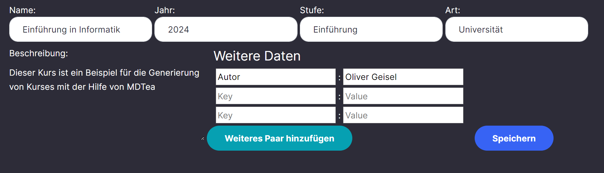

Alle Meta-Attribute werden erst gespeichert, wenn der Button "Speichern" geklickt wird.

##### Reihenfolge ändern

Alle Elemente können auf der entsprechenden Ebene bzw. in der Sammlung, in der sie sich befinden, ihre Reihenfolge
ändern.
Dazu hat jedes Element in der Struktur zwei Buttons. Einen nach oben und einen nach unten. Durch das Klicken auf
einen der beiden Buttons wird das Element eine Position nach oben oder unten verschoben.
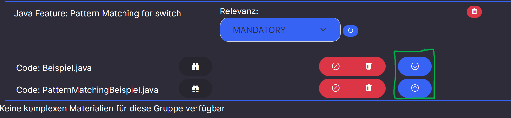

##### Assign und Unassign

Neben dem Bearbeiten der Reihenfolge können Materialien auch einem anderen Task zugewiesen werden.
Jedes Material besitzt einen Button, der ein 🚫 darstellt.
Durch das Klicken auf den Button wird das Material als unassigned markiert und ist in der Sektion "Nicht zugeordnete
Materialien" zu finden.

In der Sektion "Nicht zugeordnete Materialien" können die Materialien wieder einem Task zugewiesen werden.
Dazu muss lediglich die Id (der Name) des Tasks in das Eingabefeld eingetragen werden und auf den Button mit dem "+"  
geklickt werden.
Ein Test kann nicht einem Task zugewiesen werden. Tests können nur in Gruppen eingefügt werden.
Auch wenn in den Vorschlägen Kapitel auftauchen, so wird bei der Zuweisung nichts passieren.


##### Export eines Kurses

In der Ansicht eines Kurses gibt es die Möglichkeit, den Kurs zu exportieren.
Hierzu muss jedoch ein Kurs gültig sein.
Jedes Strukturelement (ausgenommen von Materialien) besitzt eine Relevanz.
Die Relevanz berechnet sich immer aus dem maximalen Wert der Relevanz der Kinder.
Es gibt folgende Relevanzwerte für die Strukturelemente.
Die Werte sind in absteigender Reihenfolge:

* Mandatory - Material muss vorhanden sein
* Optional - Material kann vorhanden sein (kann leer sein)
* Informational - Material ist nur informativ (kann leer sein)
* irgendwas - Material ist nicht relevant (kann leer sein)


In der Abbildung ist zu sehen, wie die Relevanz eines Tasks bearbeitet wird und dadurch ein Kurs gültig wird und
exportiert werden kann.

#### Test-Export

Jeder Test kann separat heruntergeladen werden.
Dafür muss lediglich aud dem Button mit dem Download-Symbol geklickt werden.
Das Format ist dabei immer das OPAL-Format (OpenOlat).


#### Export-Übersicht

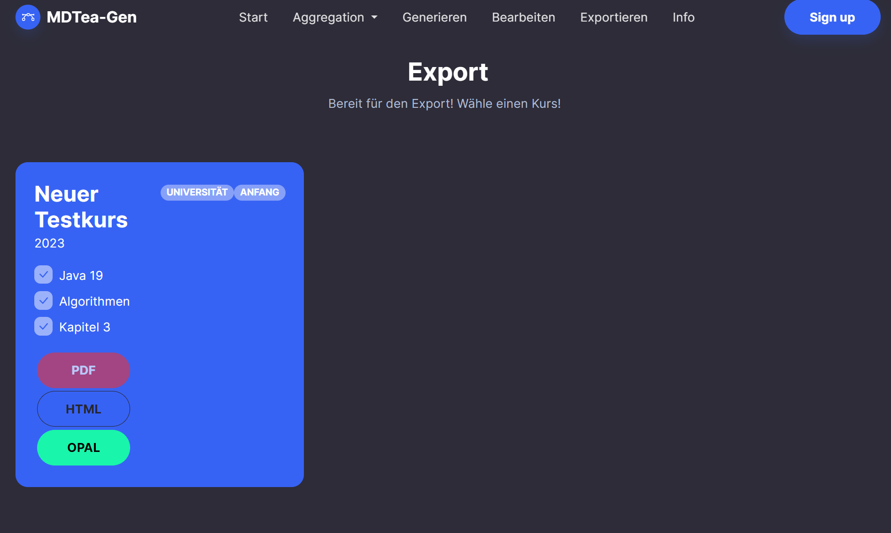
In der Abbildung ist zu sehen, welche Kurse exportiert werden können.
Durch den Klick auf den Button "Exportieren" wird der Kurs exportiert und kann heruntergeladen werden.
Es wird eine ZIP-Datei heruntergeladen.
Je nach gewähltem Export-Format kann die ZIP-Datei unterschiedlich aufgebaut sein.
Bei der Wahl von "HTML" wird der Kurs als eine Menge von HTML-Dateien exportiert, die in Ordnern strukturiert sind.
Bei der Wahl von "OPAL" wird der Kurs als eine ZIP-Datei exportiert, die in OPAL importiert werden kann.

Alternativ kann das auch in der Bearbeitungsansicht des Kurses gemacht werden.
Siehe dazu [Bearbeiten](#bearbeiten).

## Technische Details

Für eine genaue Beschreibung der technischen Details siehe [Entwicklerdokumentation](./dev-doc.md).
